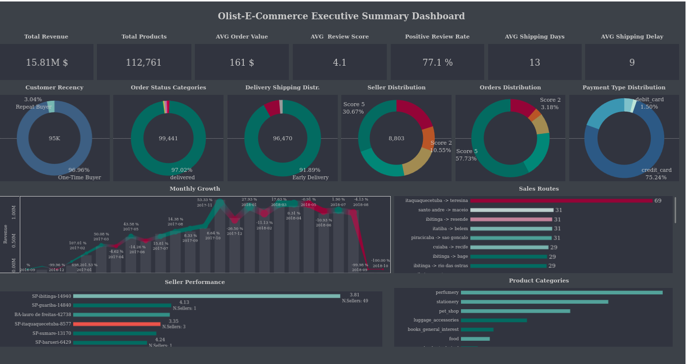

# Olist E-Commerce Sales and Operations Analysis

**Project Links & Resources**
* Full Technical Documentation: [docs](./docs/01_data_normalization)
* Interactive Tableau Dashboard: [Olist E-Commerce Dashboard](https://public.tableau.com/app/profile/vasif.asadov2730/viz/Olist_E_Commerce_Dashboard_17718506423160/Dashboard1?publish=yes)
* Raw Dataset Source: [Kaggle - Brazilian E-Commerce Public Dataset](https://www.kaggle.com/datasets/olistbr/brazilian-ecommerce)
* Database ERP Diagram: 

---

## Executive Summary

This repository contains an end-to-end data analysis of the Olist e-commerce dataset, encompassing over 100,000 orders made across Brazil. The primary objective of this project is to extract actionable business intelligence regarding customer purchasing behavior, logistics efficiency, seller performance, and revenue growth trajectories. 

By engineering a robust Star Schema in SQL Server and deploying advanced T-SQL analytical queries (window functions, cohort aggregations, and statistical variance modeling), this project identifies critical operational bottlenecks—such as the delivery "satisfaction cliff"—and highlights key revenue drivers, ultimately providing strategic recommendations for marketplace optimization.

## Technical Stack

* **Database Management:** Microsoft SQL Server 2022
* **Database Client:** DBeaver
* **Query Language:** T-SQL (Transact-SQL)
* **Data Visualization:** Tableau
* **Data Preprocessing & Documentation:** Markdown, Quarto (.qmd)

## Data Architecture and Modeling

The raw data consisted of multiple disjointed CSV files. To optimize query performance and analytical accuracy, the data was ingested and normalized into a highly structured Star Schema:

* **Fact Tables:** Orders, Order Items, Order Payments, Order Reviews.
* **Dimension Tables:** Customers, Geolocation, Products, Sellers.
* **Custom Time Dimension:** An explicitly generated `Calendar` table covering January 2016 through April 2020 to facilitate exact Month-over-Month (MoM), Year-over-Year (YoY), and rolling average calculations.
* **Integrity & Optimization:** Explicit Primary Key/Foreign Key constraints were defined, and targeted non-clustered indexes were assigned to heavy-join columns to drastically reduce query execution times.

---

## Analytical Domains & Key Findings

### Customer Behavior and Retention

Customer transaction history was analyzed using RFM (Recency, Frequency, Monetary) segmentation, Cohort Analysis, and statistical churn detection. 

* **Pareto Principle:** The customer base exhibits a heavy concentration of value, with the top 20% of users generating 53.58% of total platform revenue. 
* **Cohort Retention:** Long-term retention is a systemic weakness. Retention drops significantly after the first month, rarely breaking 0.40% by Month 6.
* **Churn Risk:** By measuring the standard deviation of historical purchase cycles, 42,051 users were flagged as statistically anomalous and at high risk of permanent churn.

| RFM Segment | Customer Count | Avg. Days Since Last Order | Avg. Lifetime Spend | Business Action |
|---|---|---|---|---|
| Champions | 18,417 | 129 | $272.96 | Prioritize for VIP loyalty programs and upselling. |
| Loyal Customers | 25,509 | 193 | $141.31 | Deploy campaigns to increase purchase frequency. |
| Hibernating | 25,937 | 453 | $84.59 | Execute aggressive re-engagement campaigns. |
| At Risk | 936 | 424 | $315.29 | High historic value, urgent intervention required. |

### Logistics and Delivery Performance

Logistics data was decomposed into approval, dispatch, and last-mile stages to identify operational bottlenecks and correlate delivery speed with customer sentiment.

* **The Satisfaction Cliff:** Correlation analysis between delivery delays and review scores identified a strict "Satisfaction Cliff." While a 1-day delay is tolerable (3.73 average score), delays stretching to 3 days cause average ratings to plummet to 2.68, resulting in permanent brand damage.
* **Speed Premium:** Fulfilling orders locally (customer and seller in the same state) provides a distinct "Speed Premium," drastically reducing average lead times compared to cross-border long-haul shipments.
* **Cart Abandonment Risk:** Products in the Furniture and Bed/Bath categories face extreme overhead, with freight costs exceeding 25-37% of the item's baseline price.

| Quality vs. Logistics Matrix | Definition | Identified Categories |
|---|---|---|
| Product/Catalog Issue | Fast Delivery / Low Rating | Computers, Party Supplies |
| Logistics Bottleneck | Slow Delivery / High Rating | Fashion Shoes, Musical Instruments |
| Systemic Failure | Slow Delivery / Low Rating | Office Furniture, Home Comfort |
| Gold Standard | Fast Delivery / High Rating | Books, General Food |

### Seller Performance and Marketplace Health

Seller fulfillment efficiency and market dominance were evaluated to ensure a healthy, competitive ecosystem.

* **Fulfillment Bottlenecks:** The bottom 10% of sellers exhibit severe logistical inefficiencies, taking between 10 to 25 days simply to hand over packaged orders to carrier partners.
* **Churn Correlation:** Sellers who churned (went inactive in 2018) had an average order cancellation rate of 6.06% in the prior year, compared to just 0.48% for retained sellers. 
* **Market Concentration:** Certain categories (e.g., PC Gamer, Security Services) are monopolized by single sellers holding over 50% of the revenue share, exposing the platform to supply chain risk if those sellers churn.

### Payments and Financial Risk

Payment behavior was analyzed to understand capital inflow and geographic banking penetration.

* **Financing High-Ticket Items:** Credit cards drive 78.3% of total revenue. Installments are critical for high-value conversions; 75.60% of all orders exceeding R$500 are financed using 5 or more installments.
* **Boleto Penetration:** Boleto (cash-based payment) utilization serves as a proxy for regional banking penetration. States like Amapá (AP) and Roraima (RR) operate at ~28% Boleto usage—well above the 20.35% national average—indicating a reliance on non-credit payment infrastructures in northern regions.

### Time Series and Growth Trajectory

Time-series aggregations mapped out the transition from linear to exponential scale.

* **Hyper-Growth & Seasonality:** The platform demonstrated extreme volatility smoothed by a 3-month rolling average. Year-over-year indexing confirmed November (Black Friday) as the ultimate seasonal peak, generating nearly 2x the standard monthly average revenue.
* **Intraday Purchasing Behavior:** Extracting day-of-week and hour-of-day distributions revealed highly predictable customer engagement patterns, specifically "Lunchtime Spikes" (12:00 PM - 2:00 PM) and "Evening Spikes" (8:00 PM - 10:00 PM).

---

## Strategic Recommendations

1. **Enforce Seller Dispatch SLAs:** Institute strict Service Level Agreements (SLAs) for the bottom 10% of sellers. A failure to hand over packages to carriers within 48 hours is directly correlated to the "Satisfaction Cliff" and elevated 1-star review volumes.
2. **Restructure Freight Subsidies for Heavy Goods:** Categories like Furniture suffer from a >30% freight ratio. Olist should negotiate volume-based logistics rates for heavy-tier items or localize inventory to prevent cart abandonment.
3. **Targeted Retention Triggers:** Automate marketing interventions at Month 2. Given the severe drop-off in Month 3 cohort retention, early lifecycle engagement is mathematically the most effective point to secure a second purchase.
4. **Leverage Intraday Bidding:** Shift ad-spend and push-notification schedules to perfectly align with the 12:00 PM and 8:00 PM engagement spikes, optimizing Customer Acquisition Cost (CAC).

---
*Authored by Vasif Asadov - Data Analyst*